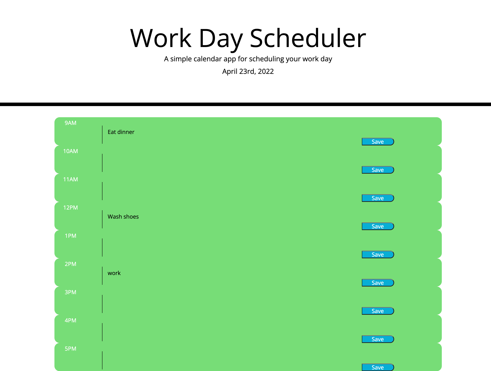

# Work-Day-Scheduler

## Description

This project was to allow the use of third-party API's to make a work scheduler. It was made to help understand the use of using third party libraries such as bootstrap and Jquery in order to provide the application with functionality. It does help with solving the problem of having to design sites from scratch, rather having some built code and plugging in helps with efficiency.

## Table of Contents 

- [Installation](#installation)
- [Usage](#usage)
- [Credits](#credits)

## Installation

N/A

## Usage

   

## Credits

David R.

